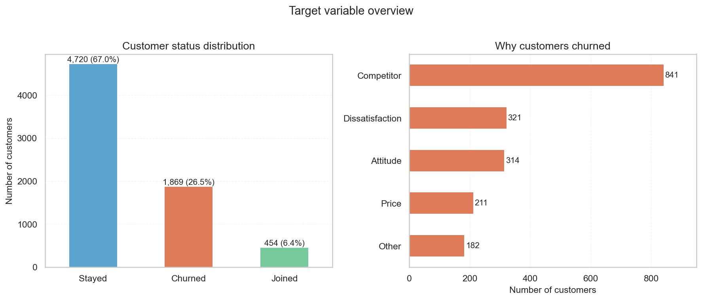
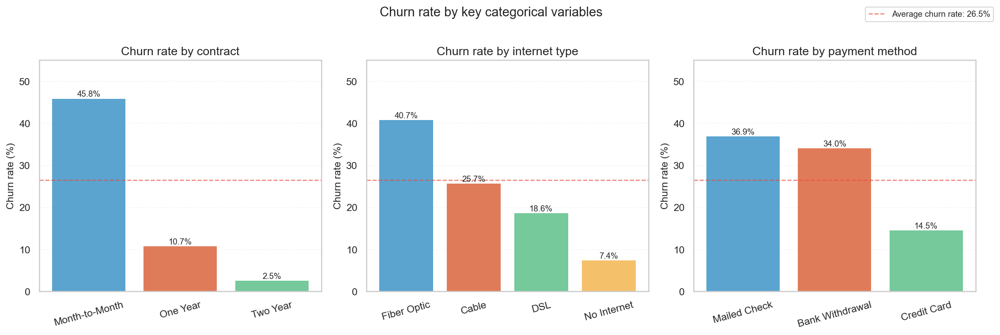
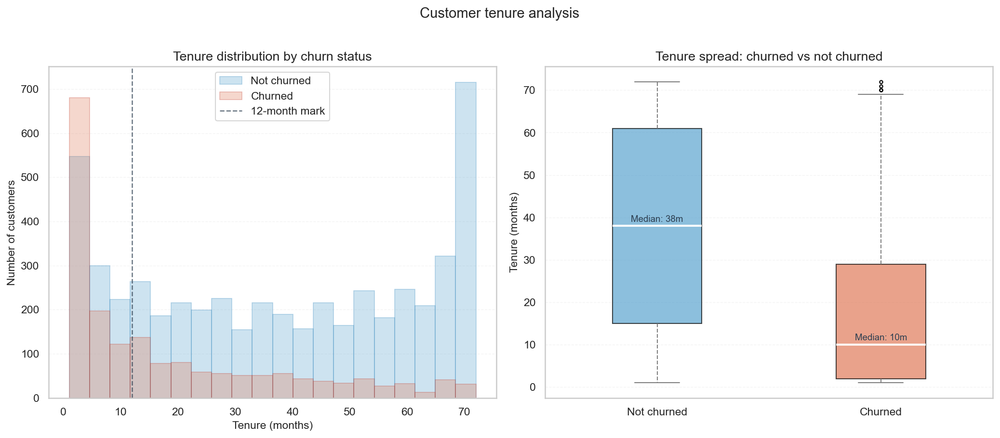
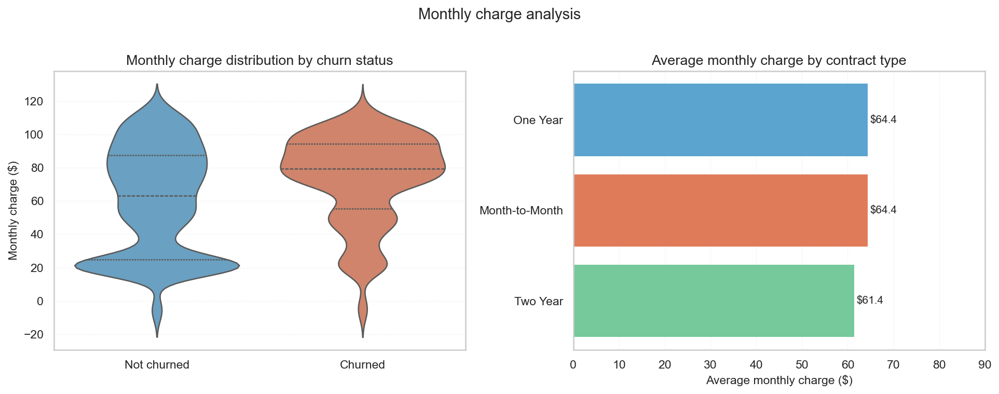
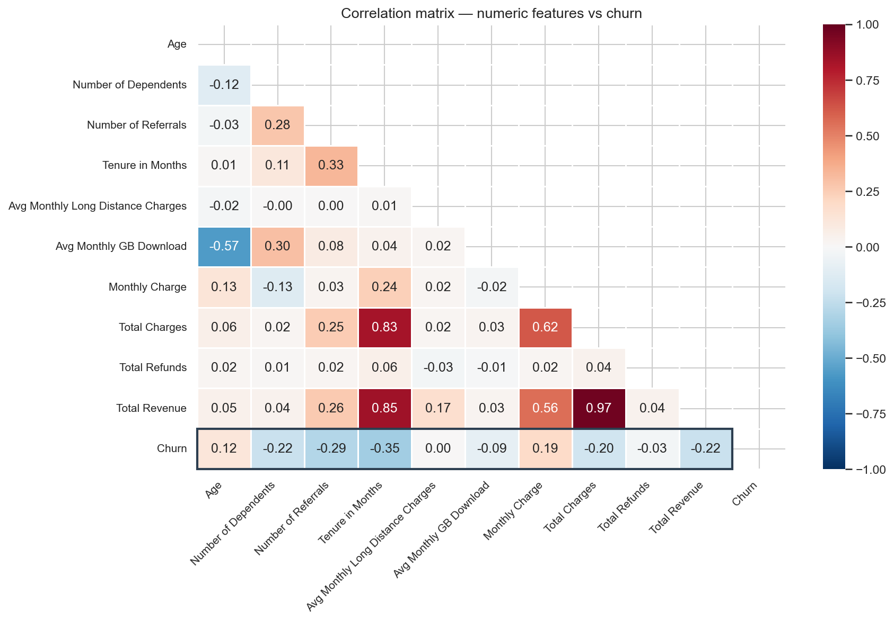
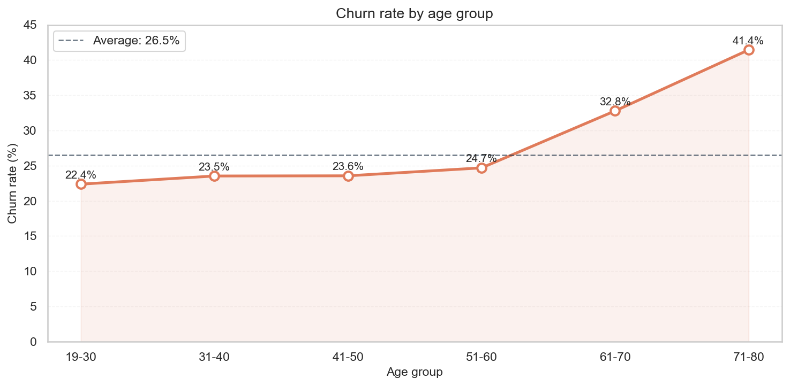
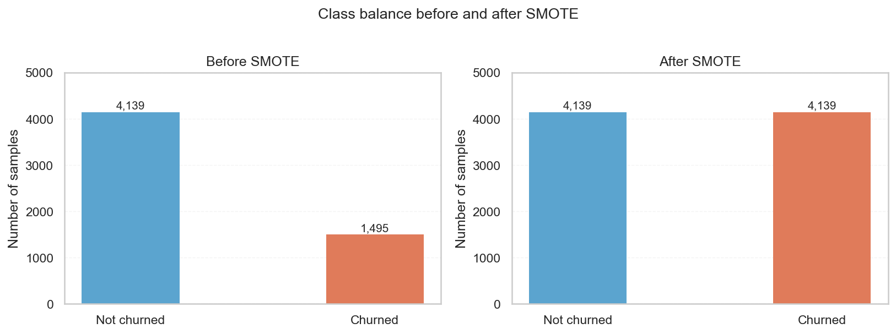
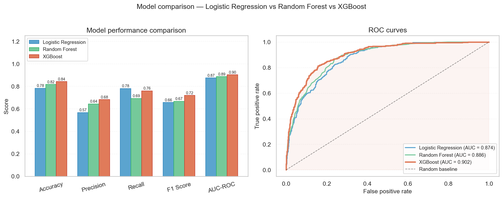
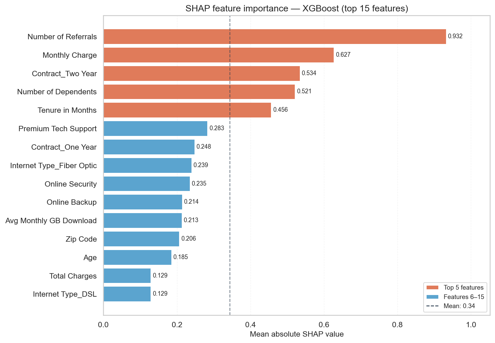
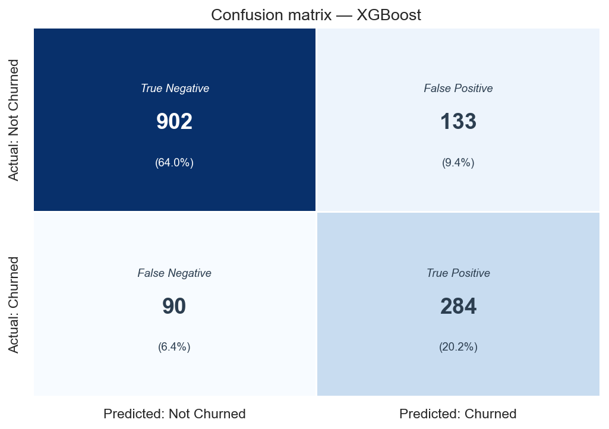

# 📉 Telco Customer Churn Prediction


---

## 📌 Project Overview

This is an end-to-end machine learning project that predicts customer churn for a fictional California-based telecommunications company using the Maven Analytics Telecom Customer Churn dataset. The project covers the complete data analytics and ML workflow — from raw data ingestion and SQL analysis, through to predictive modelling with explainability and an interactive Power BI dashboard.

The goal is to identify customers who are likely to churn, understand the key drivers behind their decision to leave, and present actionable retention insights in a business-ready format.

This project was built as part of a personal portfolio to demonstrate practical skills in Python, SQL, machine learning, model explainability, and business intelligence reporting — targeting graduate analyst roles at Big 4 consulting firms.

---

## 🎯 Project Objectives

- Load and validate a multi-table telecom dataset and design a relational PostgreSQL schema
- Perform exploratory data analysis to uncover churn patterns across customer demographics, services, and billing
- Engineer features and handle class imbalance for machine learning
- Train and compare three ML models: Logistic Regression, Random Forest, and XGBoost
- Explain model predictions using SHAP values for business stakeholder communication
- Build a three-page interactive Power BI dashboard linking ML output to business insight

---

## 📂 Dataset

- **Source:** [Maven Analytics — Telecom Customer Churn](https://mavenanalytics.io/data-playground/telecom-customer-churn)
- **Period:** Q2 2022, California, USA
- **Type:** Multi-table (relational structure)

| File | Description | Rows | Columns |
|---|---|---|---|
| `telecom_customer_churn.csv` | Main customer table — demographics, services, billing, churn outcome | 7,043 | 38 |
| `telecom_zipcode_population.csv` | California zip code population data for geographic enrichment | 1,671 | 2 |
| `telecom_data_dictionary.csv` | Column definitions and descriptions | 40 | 3 |

**Join Key:** `Zip Code` — 100% coverage confirmed (all 1,626 unique customer zip codes match the population table)

---

## 🛠️ Tools & Technologies

| Tool | Purpose |
|---|---|
| Python (pandas, numpy, matplotlib, seaborn) | Data loading, cleaning, manipulation and visualisation |
| psycopg2 / SQLAlchemy | Python-to-PostgreSQL ETL pipeline |
| PostgreSQL 17.9 | Relational schema design and SQL analysis |
| scikit-learn | Logistic Regression, Random Forest, model evaluation |
| XGBoost | Gradient boosting model |
| SHAP | Model explainability and feature importance |
| imbalanced-learn (SMOTE) | Synthetic minority oversampling |
| Power BI | Interactive three-page dashboard |
| GitHub | Version control and project hosting |
| VS Code | Development environment |

---

## 📁 Project Structure

```
telco-customer-churn/
│
├── data/
│   ├── raw/                          # Original Maven Analytics CSV files
│   │   ├── telecom_customer_churn.csv
│   │   ├── telecom_zipcode_population.csv
│   │   └── telecom_data_dictionary.csv
│   └── processed/                    # Cleaned & engineered datasets
│       ├── X_train.csv               # SMOTE-balanced training features
│       ├── X_test.csv                # Test features
│       ├── y_train.csv               # Training labels
│       └── y_test.csv                # Test labels
│
├── notebooks/
│   ├── 01_data_loading.ipynb         # Data loading, inspection & validation ✅
│   ├── 02_sql_analysis.ipynb         # PostgreSQL schema + 10 analytical queries ✅
│   ├── 03_eda.ipynb                  # Exploratory data analysis ✅
│   ├── 04_feature_engineering.ipynb  # Encoding, scaling, SMOTE ✅
│   └── 05_modelling.ipynb            # LR, RF, XGBoost + SHAP ✅
│
├── sql/                              # SQL scripts for PostgreSQL
├── powerbi/                          # Power BI dashboard (.pbix)
├── reports/figures/                  # Saved charts and plots from notebooks
├── screenshots/                      # Power BI dashboard screenshots
├── .gitignore
├── LICENSE
└── README.md
```

---

## 🔍 Project Workflow

### Notebook 1 — Data Loading & Inspection ✅

Loaded all three CSV files into pandas DataFrames and performed a thorough inspection of the dataset before any cleaning or modelling.

**Key findings:**

| Check | Result |
|---|---|
| Rows loaded | 7,043 customers × 38 columns |
| Missing values | 15 columns — all structural, not errors |
| Target variable | 26.5% churn rate — mild class imbalance |
| Top churn reason | Competitor (45% of churned customers) |
| Highest risk group | Month-to-Month contract customers (51.3%) |
| Zip code join | 100% coverage — JOIN is safe |
| Anomaly flagged | Negative Monthly Charge (-$10) — likely billing credit |

---

### Notebook 2 — SQL Analysis ✅

Designed a relational PostgreSQL schema, loaded both tables via Python using SQLAlchemy, and wrote 10 analytical queries to uncover churn patterns.

**SQL concepts used:**
`COUNT`, `SUM`, `ROUND`, `GROUP BY`, `ORDER BY`, `WHERE`, `HAVING`, `CASE WHEN`, `COALESCE`, `OVER()` window functions, `JOIN`, `LIMIT`, `::numeric` casting, `IS NOT NULL`

**Key findings from 10 queries:**

| Query | Key Finding |
|---|---|
| Overall churn rate | 26.5% baseline — 1 in 4 customers churned |
| Churn by contract | Month-to-Month 45.8% vs Two Year 2.5% — 18x difference |
| Churn by internet type | Fiber Optic highest at 40.7% despite being premium service |
| Churn by tenure | First 12 months critical — 47.4% churn rate |
| Churn by payment method | Credit Card lowest at 14.5% vs Mailed Check at 36.9% |
| Top churn reasons | Competitor advantages drive 44%+ of specific churn reasons |
| Churn by offer type | Offer A best (6.7%), Offer E worst (52.9%) |
| Revenue lost by city | San Diego $385k revenue lost — highest of any city |
| Churn by population | Larger areas churn slightly more (30.7% vs 24.5%) |
| High value customers | Every top 10 high-value churned customer was on Fiber Optic |

---

### Notebook 3 — Exploratory Data Analysis ✅

Performed deep visual exploration using 6 different chart types across 5 analysis areas.

**Chart types used:** Bar chart, horizontal bar, histogram, box plot, violin plot, heatmap, line chart with area fill

#### Churn Distribution


#### Churn Rate by Key Categories


#### Tenure Analysis


#### Monthly Charge Analysis


#### Correlation Heatmap


#### Churn Rate by Age Group


**Key findings:**

| Analysis | Key Finding |
|---|---|
| Churn distribution | Competitor (841) is the dominant churn reason |
| Churn by category | Month-to-Month 45.8% vs Two Year 2.5% |
| Tenure analysis | Churned customers median tenure 10 months vs 38 months |
| Monthly charge | Churned customers concentrated at high charges ($80-95) |
| Correlation | Tenure (-0.35) strongest negative correlator with churn |
| Age analysis | Churn rises sharply after 50 — 41.4% for customers aged 71-80 |

---

### Notebook 4 — Feature Engineering ✅

Transformed raw data into a clean, numeric, model-ready format.

#### Class Balance Before and After SMOTE


**Steps completed:**

| Step | Action | Result |
|---|---|---|
| Drop columns | Removed 7 irrelevant/leakage columns | 38 → 32 columns |
| Handle nulls | Business-logic fill for all 15 null columns | 0 nulls remaining |
| Binary encoding | Label encoded 14 Yes/No columns | All → 0 or 1 |
| One-hot encoding | Encoded 4 multi-category columns | 32 → 40 columns |
| Train/test split | Stratified 80/20 split | 5,634 train / 1,409 test |
| Scaling | StandardScaler on 13 numeric columns | Mean ~0, Std ~1 |
| SMOTE | Balanced minority class in training set | 5,634 → 8,278 rows |
| Export | Saved 4 processed files to data/processed/ | Ready for modelling |

---

### Notebook 5 — ML Modelling & Evaluation ✅

Trained and compared three machine learning models. Selected XGBoost as the best performer with AUC-ROC of 0.902.

#### Model Comparison


**Model results:**

| Model | Accuracy | Precision | Recall | F1 Score | AUC-ROC |
|---|---|---|---|---|---|
| Logistic Regression | 0.783 | 0.566 | 0.781 | 0.656 | 0.874 |
| Random Forest | 0.816 | 0.643 | 0.693 | 0.667 | 0.886 |
| **XGBoost** | **0.842** | **0.681** | **0.759** | **0.718** | **0.902** |

#### SHAP Feature Importance — XGBoost


#### Confusion Matrix — XGBoost


**Key findings:**
- XGBoost achieves AUC-ROC of 0.902 — crosses the 90% threshold considered excellent for churn prediction
- Number of Referrals is the strongest churn predictor (SHAP = 0.932) — loyal customers actively refer others
- Monthly Charge (0.627) and Contract_Two Year (0.534) confirm SQL findings
- XGBoost correctly identifies 284 of 374 churned customers (76% recall)
- Only 90 false negatives (6.4%) — missed churners the company had no chance to retain

---

## 📊 Key Business Insights

1. **26.5% overall churn rate** — roughly 1 in 4 customers left in Q2 2022
2. **Contract type is the strongest churn signal** — Month-to-Month customers churn at 18x the rate of Two Year customers
3. **First 12 months is the critical retention window** — 47.4% of new customers churn within the first year
4. **Fiber Optic has a retention problem** — 40.7% churn rate and all top high-value churned customers were on Fiber Optic
5. **Competitor advantages drive 44%+ of churn** — better devices, better offers, faster speeds
6. **Number of Referrals is the top ML predictor** — customers who refer others almost never leave
7. **Offer A is the most effective retention tool** — 6.7% churn vs 52.9% for Offer E
8. **Older customers are significantly higher risk** — 41.4% churn rate for customers aged 71-80

---

## ▶️ How to Run This Project

**1. Clone the repository:**
```bash
git clone https://github.com/jadliudit/telco-customer-churn.git
cd telco-customer-churn
```

**2. Install required libraries:**
```bash
pip install pandas numpy matplotlib seaborn scikit-learn xgboost shap imbalanced-learn sqlalchemy psycopg2-binary jupyter ipykernel
```

**3. Download the dataset:**

Go to [Maven Analytics Data Playground](https://mavenanalytics.io/data-playground/telecom-customer-churn) and download the three CSV files. Place them in `data/raw/`.

**4. Set up PostgreSQL:**
- Install PostgreSQL 17.9 from [postgresql.org](https://www.postgresql.org/download/)
- Create a database called `telecom_churn`
- Update the connection string in `02_sql_analysis.ipynb` with your credentials

**5. Run the notebooks in order:**
```bash
jupyter notebook notebooks/01_data_loading.ipynb
```

---

## 📈 Project Status

| Phase | Notebook | Status |
|---|---|---|
| Data Loading & Inspection | `01_data_loading.ipynb` | ✅ Complete |
| SQL Analysis | `02_sql_analysis.ipynb` | ✅ Complete |
| Exploratory Data Analysis | `03_eda.ipynb` | ✅ Complete |
| Feature Engineering | `04_feature_engineering.ipynb` | ✅ Complete |
| ML Modelling & SHAP | `05_modelling.ipynb` | ✅ Complete |
| Power BI Dashboard | `telco_churn_dashboard.pbix` | 🔄 In Progress |

---

## 👤 Author

**Udit Jadli**

- 📧 jadliudit@gmail.com
- 💼 [LinkedIn](https://www.linkedin.com/in/jadliudit97/)
- 🐙 [GitHub](https://github.com/jadliudit)
- 🌐 [Portfolio](https://portfolio-preview-62.emergent.host)